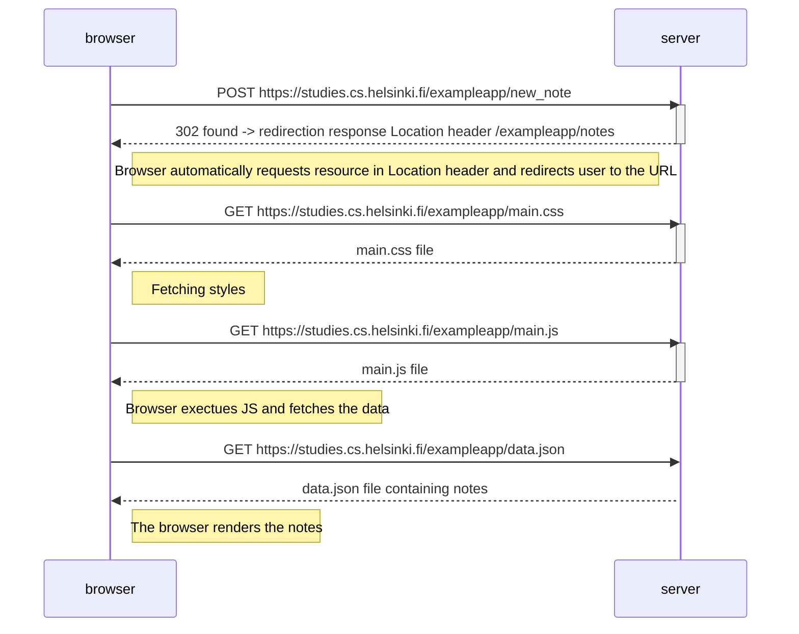

```mermaid
sequenceDiagram
    participant browser
    participant server 

    browser->>server: POST https://studies.cs.helsinki.fi/exampleapp/new_note
    activate server
    server-->>browser: 302 found -> redirection response Location header /exampleapp/notes
    deactivate server
    Note right of browser: Browser automatically requests resource in Location header and redirects user to the URL

    browser->>server: GET https://studies.cs.helsinki.fi/exampleapp/main.css
    activate server
    server-->>browser: main.css file
    deactivate server
    Note right of browser: Fetching styles

    browser->>server: GET https://studies.cs.helsinki.fi/exampleapp/main.js
    activate server
    server-->>browser: main.js file
    deactivate server
    Note right of browser: Browser exectues JS and fetches the data

    browser->>server: GET https://studies.cs.helsinki.fi/exampleapp/data.json
    activate server
    server-->>browser: data.json file containing notes

    Note right of browser: The browser renders the notes
```