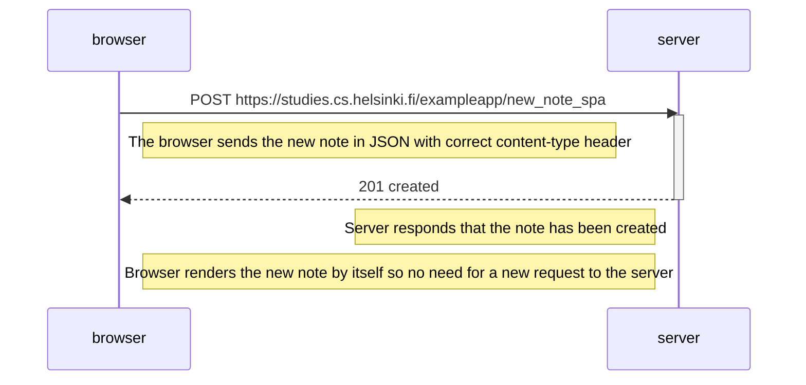

```mermaid
sequenceDiagram
    participant browser
    participant server 

    browser->>server: POST https://studies.cs.helsinki.fi/exampleapp/new_note_spa
    activate server
    Note right of browser: The browser sends the new note in JSON with correct content-type header
    server-->>browser: 201 created
    deactivate server

    Note left of server: Server responds that the note has been created
    Note right of browser: Browser renders the new note by itself so no need for a new request to the server
```